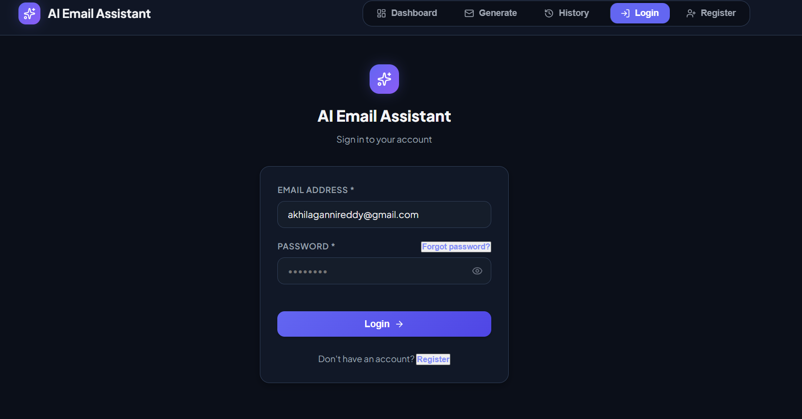
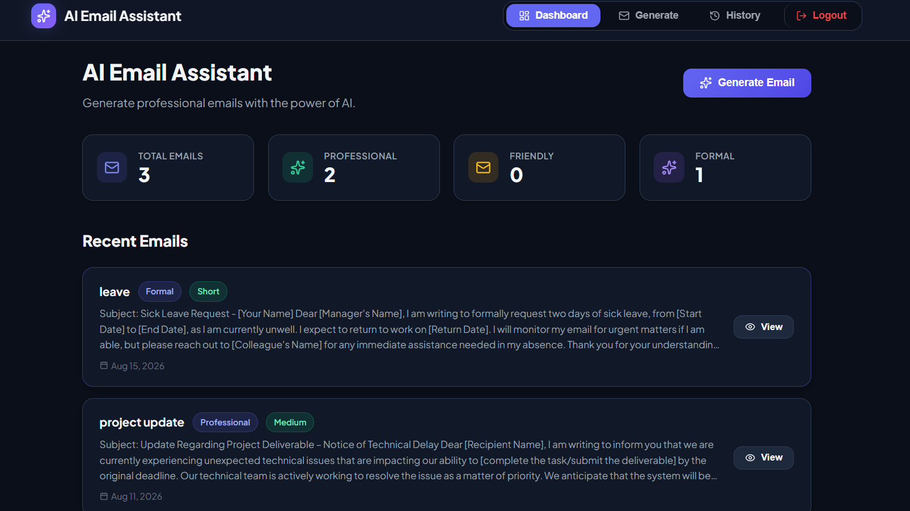

# 🤖 AI Email Assistant

An AI-powered email assistant that helps users create professional emails quickly using simple prompts. It supports multiple tones, different email lengths, native-language prompts, and saved email management.

## Features ✨

- 🤖 **AI Email Generation** – Generate professional emails from simple prompts
- 🌐 **Native Language Prompts** – Give prompts in your native language and generate professional emails
- 🎨 **Multiple Tones** – Professional, Friendly, Formal, Apology, Thank You, and Follow-up
- 📏 **Multiple Lengths** – Short, Medium, and Long emails
- 🔄 **Regenerate Email** – Generate a new version of an email instantly
- 💾 **Save Emails** – Save generated emails for future use
- 🔍 **Search Emails** – Search previously saved emails
- 📋 **Copy to Clipboard** – Copy generated emails instantly
- 🔐 **JWT Authentication** – Secure user registration and login


## Tech Stack 🛠️

- **Frontend:** React
- **Backend:** Spring Boot
- **AI:** Google Gemini API
- **Database:** MySQL
- **Authentication:** JWT
- **Build Tool:** Maven
- **API Testing:** Postman
- **Version Control:** Git & GitHub

## Prerequisites 📋

- Java 25+
- Maven
- Node.js and npm
- MySQL 8+
- Google Gemini API Key

## Screenshots 📸

### 🔐 Login


### 🏠 Dashboard


### ✨ Generate Email


### 📧 Generated Email


## Installation & Setup ⚙️

Clone the repository:

```bash
git clone https://github.com/BhavyaAkhila/AI-Email-Assistant.git
cd AI-Email-Assistant
```

### Backend Environment Variables

Configure the following environment variables:

```text
DATABASE_URL
DATABASE_USERNAME
DATABASE_PASSWORD
JWT_SECRET
GEMINI_API_KEY
FRONTEND_URL
```

### Run the Backend

```bash
cd assistant
.\mvnw.cmd spring-boot:run
```

### Run the Frontend

```bash
cd frontend
npm install
npm run dev
```

Open the frontend in your browser and start generating emails.

## Example Prompt 🚀

```text
Write an email to my professor asking for an extension on my assignment.
```

You can also provide your prompt in your **native language** and the AI will generate a professional email based on your request.

## Key API Endpoints 📡

| Endpoint | Method | Description |
|----------|--------|-------------|
| `/api/auth/register` | POST | Register a new user |
| `/api/auth/login` | POST | Login and receive JWT |
| `/api/ai/generate` | POST | Generate an AI-powered email |
| `/api/ai/save` | POST | Save a generated email |
| `/api/emails` | GET | View saved emails |


